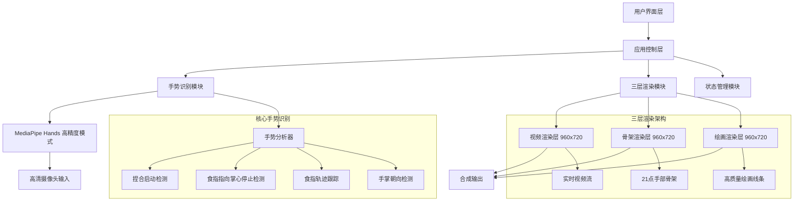
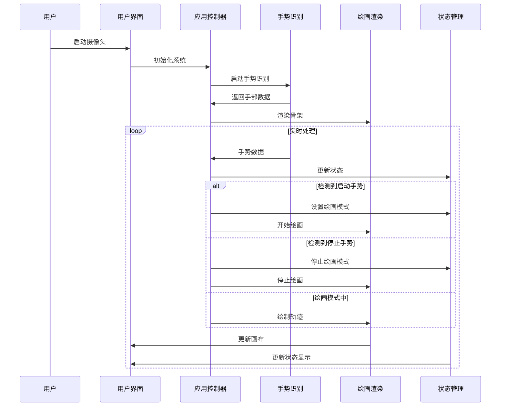
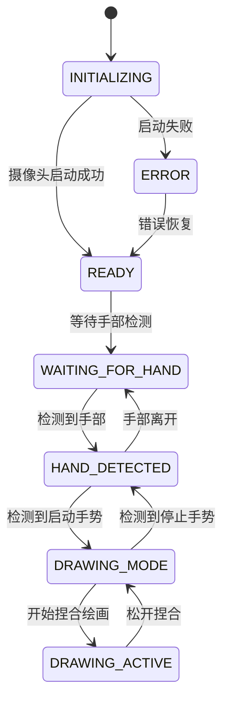

# Design Document

## Overview

AI手势绘画应用是一个基于Web的高清实时手势识别绘画系统，使用MediaPipe Hands进行精确的手部检测和21个关键点的骨架识别，通过多层Canvas API实现滤镜式绘画功能。系统采用三层渲染架构：实时视频层、手部骨架层和绘画内容层，创造出在实时视频上绘画的沉浸式体验。支持960x720高清分辨率，提供流畅的手势识别和绘画体验。

## Architecture

### 系统架构图



### 数据流图



## Components and Interfaces

### 1. 应用控制器 (HandGestureDrawing)

**职责：** 系统的主控制器，协调各个模块的工作

**接口：**
```javascript
class HandGestureDrawing {
    constructor()
    async startCamera()
    onResults(results)
    updateStatus(message, type)
    updateDebug(message)
}
```

**关键方法：**
- `startCamera()`: 初始化摄像头和MediaPipe
- `onResults()`: 处理MediaPipe返回的手部检测结果
- `updateStatus()`: 更新用户界面状态

### 2. 手势识别模块 (GestureRecognizer)

**职责：** 分析手部数据，识别特定手势

**接口：**
```javascript
class GestureRecognizer {
    constructor()
    analyzeHands(landmarks)
    detectStartGesture(landmarks)
    detectStopGesture(landmarks)
    detectPinchGesture(landmarks)
    calculateHandOrientation(landmarks)
    isHandFacingCamera(landmarks)
}
```

**手势识别算法：**

1. **启动手势检测（拇指+食指捏合）：**
   - 检测手掌是否面向摄像头（通过手掌法向量计算）
   - 检测拇指和食指尖之间的距离是否小于动态阈值
   - 基于手掌朝向和捏合状态计算置信度
   - 响应时间优化至100毫秒内

2. **停止手势检测（食指指向掌心）：**
   - 检测食指是否伸直（食指尖位置高于关节）
   - 检测其他手指是否弯曲（中指、无名指、小指）
   - 计算食指指向方向与掌心方向的夹角
   - 当夹角小于60度时识别为停止手势

3. **绘画轨迹跟踪：**
   - 在绘画模式下实时跟踪食指尖位置
   - 应用高质量线条渲染（8像素粗细，阴影效果）
   - 确保线条与实时视频完美叠加
   - 支持连续绘画和线条持久保留

4. **手掌朝向检测：**
   - 使用手掌关键点计算法向量
   - 判断手掌是否面向摄像头
   - 作为启动手势的必要条件

### 3. 绘画渲染模块 (DrawingRenderer)

**职责：** 处理所有视觉渲染，包括绘画线条和手部骨架

**接口：**
```javascript
class DrawingRenderer {
    constructor(canvas, context)
    drawLine(from, to, color, width)
    drawHandSkeleton(landmarks, handedness)
    clearCanvas()
    saveImage(video)
    smoothPath(points)
}
```

**三层渲染架构：**

1. **视频渲染层（底层）：**
   - 960x720高清实时视频流
   - 镜像翻转处理
   - 流畅的帧率显示

2. **骨架渲染层（中层）：**
   - 绘制21个手部关键点
   - 连接关键点形成完整骨架结构
   - 使用不同颜色区分左右手（左手绿色，右手橙色）
   - 根据检测置信度动态调整透明度和线条粗细
   - 特殊标注拇指和食指尖用于捏合检测

3. **绘画渲染层（顶层）：**
   - 高质量线条绘制（8像素粗细）
   - 阴影效果增强视觉效果
   - 支持多种颜色选择
   - 实时食指轨迹跟踪
   - 线条持久保留
   - 抗锯齿处理确保平滑效果

### 4. 状态管理模块 (StateManager)

**职责：** 管理应用状态和状态转换

**状态定义：**
```javascript
const AppStates = {
    INITIALIZING: 'initializing',
    READY: 'ready',
    WAITING_FOR_HAND: 'waiting_for_hand',
    HAND_DETECTED: 'hand_detected',
    DRAWING_MODE: 'drawing_mode',
    DRAWING_ACTIVE: 'drawing_active',
    ERROR: 'error'
};
```

**状态转换图：**


## Data Models

### 1. 手部数据模型

```javascript
interface HandData {
    landmarks: Array<{x: number, y: number, z: number}>;
    handedness: 'Left' | 'Right';
    confidence: number;
    boundingBox: {x: number, y: number, width: number, height: number};
}
```

### 2. 手势数据模型

```javascript
interface GestureData {
    type: 'start' | 'stop' | 'pinch' | 'none';
    confidence: number;
    position: {x: number, y: number};
    metadata: {
        palmFacing: boolean;
        pinchDistance: number;
        handOrientation: number;
    };
}
```

### 3. 绘画数据模型

```javascript
interface DrawingStroke {
    points: Array<{x: number, y: number, timestamp: number}>;
    color: string;
    width: number;
    completed: boolean;
}

interface DrawingState {
    strokes: DrawingStroke[];
    currentStroke: DrawingStroke | null;
    isDrawing: boolean;
    selectedColor: string;
    lineWidth: number;
}
```

## Error Handling

### 1. 摄像头访问错误

```javascript
class CameraError extends Error {
    constructor(message, code) {
        super(message);
        this.name = 'CameraError';
        this.code = code;
    }
}

// 错误处理策略
const handleCameraError = (error) => {
    switch(error.name) {
        case 'NotAllowedError':
            return '摄像头权限被拒绝，请在浏览器设置中允许摄像头访问';
        case 'NotFoundError':
            return '未找到摄像头设备，请检查设备连接';
        case 'NotReadableError':
            return '摄像头被其他应用占用，请关闭其他应用后重试';
        default:
            return '摄像头启动失败，请刷新页面重试';
    }
};
```

### 2. MediaPipe加载错误

```javascript
const handleMediaPipeError = (error) => {
    console.error('MediaPipe加载失败:', error);
    return {
        message: 'AI模型加载失败，请检查网络连接',
        recovery: () => {
            // 尝试重新加载MediaPipe
            location.reload();
        }
    };
};
```

### 3. 手势识别错误

```javascript
const handleGestureError = (error) => {
    console.warn('手势识别异常:', error);
    // 不中断应用运行，只记录错误
    return {
        fallback: 'continue',
        message: '手势识别暂时不可用，请重新尝试'
    };
};
```

## Testing Strategy

### 1. 单元测试

**测试覆盖范围：**
- 手势识别算法的准确性
- 绘画渲染功能的正确性
- 状态管理的状态转换
- 错误处理机制

**测试工具：** Jest + Canvas Mock

```javascript
// 示例测试用例
describe('GestureRecognizer', () => {
    test('should detect pinch gesture correctly', () => {
        const landmarks = mockPinchGestureLandmarks();
        const result = gestureRecognizer.detectPinchGesture(landmarks);
        expect(result.isPinching).toBe(true);
        expect(result.confidence).toBeGreaterThan(0.8);
    });
});
```

### 2. 集成测试

**测试场景：**
- 完整的手势识别到绘画流程
- 多手检测和处理
- 错误恢复机制
- 性能压力测试

### 3. 用户体验测试

**测试指标：**
- 手势识别响应时间 < 100ms
- 绘画轨迹平滑度
- 系统稳定性（长时间使用）
- 不同光照条件下的识别准确率

### 4. 性能测试

**关键指标：**
- 帧率保持 > 15fps
- 内存使用稳定
- CPU使用率 < 80%
- 手势识别准确率 > 90%

**性能优化策略：**
- 降低MediaPipe处理频率
- 使用requestAnimationFrame优化渲染
- 实现对象池减少GC压力
- 异步处理非关键任务

## Implementation Considerations

### 1. 浏览器兼容性

- 支持现代浏览器（Chrome 88+, Firefox 85+, Safari 14+）
- 使用WebRTC getUserMedia API
- Canvas 2D API支持
- ES6+ 语法支持

### 2. 性能优化

- 使用Web Workers处理计算密集型任务
- 实现帧率自适应调整
- 优化Canvas渲染性能
- 内存管理和垃圾回收优化

### 3. 用户体验

- 提供清晰的视觉反馈
- 实现渐进式功能加载
- 错误状态的友好提示
- 响应式设计适配不同屏幕

### 4. 扩展性设计

- 模块化架构便于功能扩展
- 插件化的手势识别器
- 可配置的绘画工具
- 支持自定义手势定义